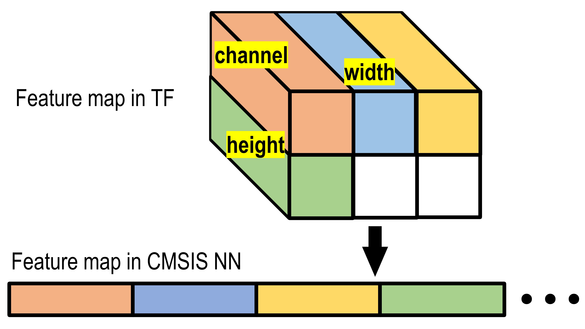

# On-chip-CNN-deployment-with-CMSIS-NN

## 16 bit per-tensor quantization in CMSIS NN 

### Background Knowledge

https://community.arm.com/developer/ip-products/processors/b/processors-ip-blog/posts/deploying-convolutional-neural-network-on-cortex-m-with-cmsis-nn
https://developer.arm.com/solutions/machine-learning-on-arm/developer-material/how-to-guides/converting-a-neural-network-for-arm-cortex-m-with-cmsis-nn


### Mathematic
x  denotes weight / bias / tensor
$$
range: [-2^{15}, 2^{15} - 1]
$$

$$
k = 15 - \lceil{log_2(max|x|)}\rceil
$$

$$
x_q = round(x \times 2^{k})
$$

Get float x' from quantized xq:

$$
x^{'} = \frac {x_q} {2^k}
$$

integer only calculation

$$
weight: w_q = w^{'} \times 2^{k_w}
$$

$$
bias: b_q = b^{'} \times 2^{k_b}
$$

$$
input\, tensor: x_q = x^{'} \times 2^{k_x}
$$

$$
output\, tensor: o_q = o^{'} \times 2^{k_o}
$$

floating point:

$$
o^{'} = w^{'} \times x^{'} + b^{'}
$$

we need to get o' from wq, xq and bq

$$
w_q \times x_q + b_q << b_{lshift}= w^{'} \times x^{'} \times 2^{k_w + k_x} + b^{'} \times 2 ^{k_b + b_{lshift}}
$$

$$
let\quad b_{lshift} = k_x + k_w - k_b
$$

$$
w_q \times x_q + b_q << b_{lshift}= {(w^{'} \times x^{'} + b^{'})} \times 2^{k_w + k_x}
$$

$$
let\quad o_{rshift} = k_x + k_w - k_o
$$

$$
(w_q \times x_q + b_q << b_{lshift}) >> o_{rshift}= {(w^{'} \times x^{'} + b^{'})} \times 2^{k_w + k_x-o_{rshift}}=o^{'} \times 2^{k_o} = o_q
$$

to quantize a network, we need to know:

1. bias left shift for each layer
2. output right shift for each layer
3. input and output quantization format

### In practice
1. quantize weight and bias, find max|w| and max|b| to compute kw and kb, save the quantized weight and bias.

2. run the model on a test set to find max|x| of each intermediate tensor, and then compute kx

3. calculate bias shift and output shift for each layer.

$$
b_{lshift} = k_x + k_w - k_b
$$

$$
o_{rshift} = k_x + k_w - k_o
$$

### Data format (from a 2D/3D/4D tensor to a flat buffer)

In CMSIS NN everything is stored as a 1D array, so before saving quantized weights, you need to convert them to flat buffers.

```python
# for tensorflow 2.n
# Convolutional layer
weight_conv_flat = np.moveaxis(weight_conv, 2, 0).flatten("F")

# Fully connected layer
weight_fc_flat = np.moveaxis(weight_fc_flat, 1, 0).flatten()
```

for intermediate feature maps



### Documentation

https://www.keil.com/pack/doc/CMSIS/NN/html/index.html

https://github.com/ARM-software/CMSIS_5

